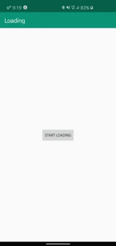

[](http://www.apache.org/licenses/LICENSE-2.0.html)
[](https://jitpack.io/#EdgeJH/InAppUpdate)

# LoadingFragment
Easy Loading Fragment


### Example



## Download

``` gradle
allprojects {
	repositories {
		...
		maven { url 'https://jitpack.io' }
	}
}
  
dependencies {
	implementation 'com.github.EdgeJH:InAppUpdate:1.0.2'
}

```

### Usage

```java

class ExampleFragment : LoadingFragment() {

    private val handler =Handler()

    override fun onCreateView(inflater: LayoutInflater, container: ViewGroup?, savedInstanceState: Bundle?): View? {
        return inflater.inflate(R.layout.fragment_example, container, false)
    }

    override fun onActivityCreated(savedInstanceState: Bundle?) {
        super.onActivityCreated(savedInstanceState)
        setView(view!! as ViewGroup)
        /*Default layout_loading_fail
        * this Layout contains refresh button and OnRefreshClickListener
        * If you custom this Layout use this method
        * setFailView(R.layout.layout_loading_fail)
        * */
        setProgressColor(R.color.colorAccent)
        loadingBtn.setOnClickListener {
            startLoading()
            loadingFail()
        }
        setOnRefreshClickListener(object : OnRefreshClickListener {
            override fun onRefreshClick() {
                startLoading()
                loadingFinish()
            }
        })
    }

    private fun loadingFinish(){
        handler.postDelayed({
            finishLoading()
        },2000)
    }

    private fun loadingFail(){
        handler.postDelayed({
            failLoading()
        },2000)
    }
}

```

### Method:

* `startLoading()`
* `finishLoading()`
* `failLoading()`
* `setProgressColor(R.color.colorAccent)`
* `setFailView(R.layout.layout_loading_fail)`
* `setView(view!! as ViewGroup)`
* `setOnRefreshClickListener(object : OnRefreshClickListener {})`
        

License
--------
```
Copyright 2017 EdgeJH


Licensed under the Apache License, Version 2.0 (the "License");
you may not use this file except in compliance with the License.
You may obtain a copy of the License at

http://www.apache.org/licenses/LICENSE-2.0

Unless required by applicable law or agreed to in writing, software
distributed under the License is distributed on an "AS IS" BASIS,
WITHOUT WARRANTIES OR CONDITIONS OF ANY KIND, either express or implied.
See the License for the specific language governing permissions and
limitations under the License.

```


